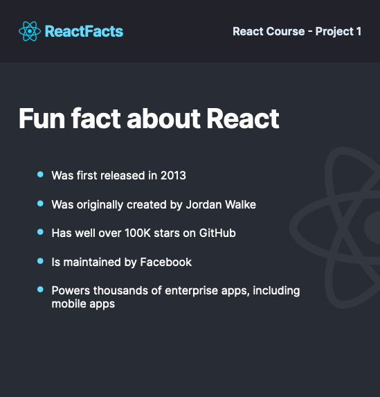

# About React

This project is my solution to the practice project as part of the [Scrimba React course](https://scrimba.com/learn/learnreact) I am taking by [Bob Ziroll](https://twitter.com/bobziroll).

## Table of contents

- [Overview](#overview)
  - [The Project](#the-project)
  - [Screenshot](#screenshot)
  - [Links](#links)
- [My Process](#my-process)
  - [Built With](#built-with)
  - [What I Learned](#what-i-learned)
- [Author](#author)

## Overview

The aim of this project was to allow me to recreate a design to look as closely as possible to the Figma design file.

### The project

Use the provided Figma file to recreate the design using your current Reactjs knowledge.

### Screenshot

### Links

- [Live Site](https://prj-about-react.vercel.app/)

## My Process

Break up the designs into individual parent/child components. Then reconstruct it from the base up.

### Built With

- Semantic HTML5 markup
- CSS
- Flexbox

### What I Learned

- I learnt how to create custom components, how to apply style to them and render them using JSX.

## Author

- GitHub - [@jdfdoyley](https://github.com/jdfdoyley)
- Twitter - [@jdfdoyley](https://twitter.com/jdfdoyley)
- LinkedIn - [@jdfdoyley](https://www.linkedin.com/in/jdfdoyley/)
